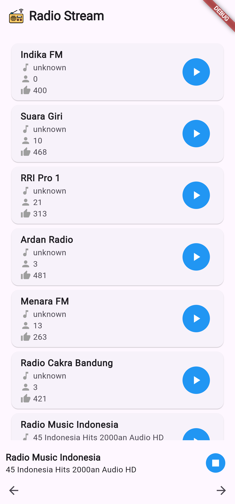

# Radio Stream Flutter

Radio Stream Flutter adalah aplikasi Flutter untuk streaming siaran radio online dengan fitur daftar stasiun, kontrol pemutaran.

## Alat Pengembangan

- Flutter 3.24.2
- Tools • Dart 3.5.2 • DevTools 2.37.2

## Jalankan Program

- `git clone https://github.com/fitri-hy/radio_sream_flutter.git`
- `cd radio_sream_flutter`
- `flutter pub get`
- `flutter run`

## Menghasilkan Keystore

```
keytool -genkeypair -v -keystore radio-stream-key.keystore -keyalg RSA -keysize 2048 -validity 10000 -storepass 220898 -keypass 220898 -alias radio-stream
```

## Peluncuran

```
flutter build apk --release
flutter build appbundle
```

<div style="display: flex; flex-wrap: wrap;">
  
</div>
